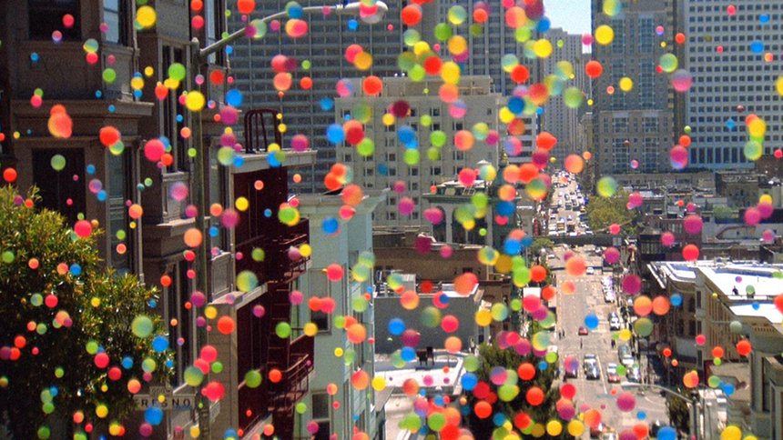
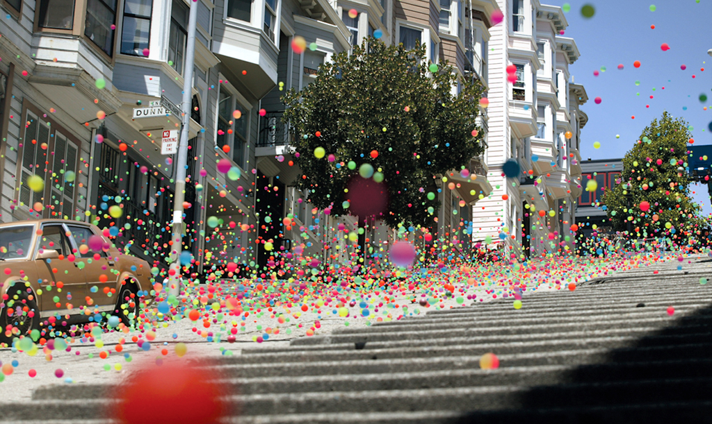

# Masters Project 2016
> Replicating Particle Behaviours.

This project is developed with Houdini 15.

## Installation

This program runs in Houdini on any platforms: OS X , Windows & Linux.

## Idea behind project

Seeing Sony's Bravias Ad, I wanted to create a similar effect using particle systems.

## Development setup
Run Houdini and Open Submission_03.hip file.

## Release History

# Developing Stages

* Submission_01 : This file has the initial model of having particles.
   
* Submission_02: This file has particles running over through a path.
    * NOTE: The path.obj and ooo.obj must be imported. 
   
File with rendered sequence working. Each file has its parameters like force modified to show different amounts of variation in the particles movement.

* Submission_03A: All particles spread widely

* Submission_03B: Movement is restricted a bit

* Submission_03C:  Movement is tight

## Meta

Nikitha Ann George – [Nikitha Ann](https://in.linkedin.com/in/nikitha-george-b0364065) – nikitha.ann.g@gmail.com

[GitHub Profile](https://github.com/NikithaAnn)

[npm-image]: https://img.shields.io/npm/v/datadog-metrics.svg?style=flat-square
[npm-url]: https://npmjs.org/package/datadog-metrics
[npm-downloads]: https://img.shields.io/npm/dm/datadog-metrics.svg?style=flat-square
[travis-image]: https://img.shields.io/travis/dbader/node-datadog-metrics/master.svg?style=flat-square
[travis-url]: https://travis-ci.org/dbader/node-datadog-metrics
